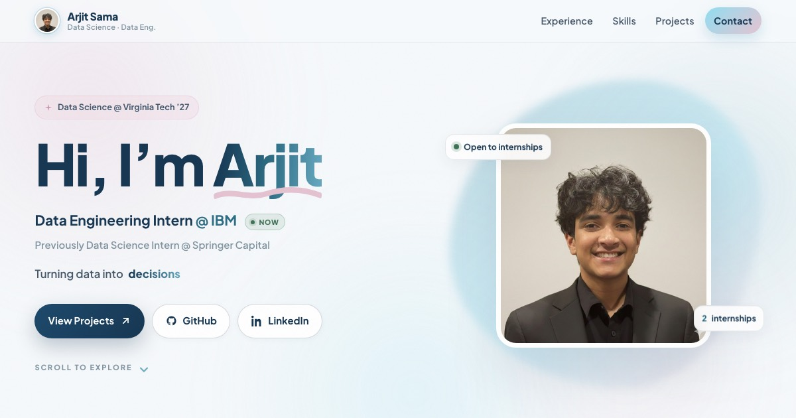

# 🌐 Arjit Sama, Portfolio Website


A personal portfolio showcasing my skills, projects, and contact information.

---

## 📌 Features
- **Responsive Design**: works on desktop, tablet, and mobile.
- **Skills Section**: programming languages and developer tools with years of experience.
- **Projects Showcase**: key projects with logos, descriptions, and links to the repos.
- **Contact Section**: email, GitHub, and LinkedIn.

---

## 🌐 Live Demo
[View the portfolio](https://arjitsama.github.io/portfolio/)

---

## 📸 Screenshot


---

## 🛠️ Built With

- HTML5
- CSS3
- JavaScript

---

## 🚀 Getting Started

### 1️⃣ Clone the Repository
```bash
git clone https://github.com/arjitsama/portfolio.git
cd portfolio
```

### 2️⃣ Open in Browser
```bash
open index.html
```
